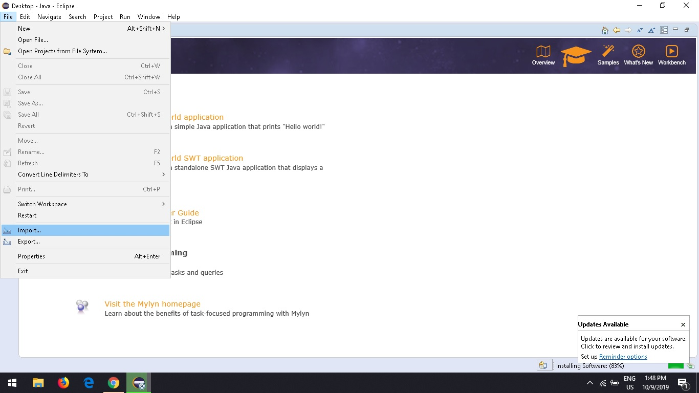
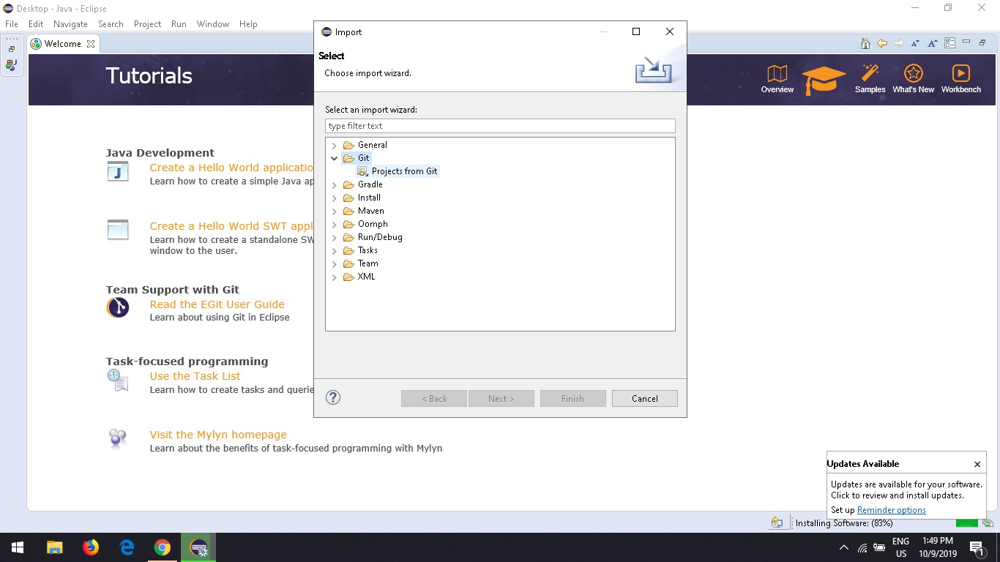
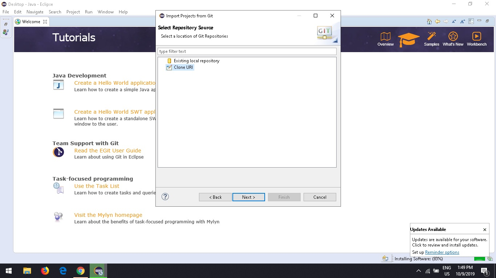

# Game Of Life 
[Convey's game of life](https://en.wikipedia.org/wiki/Conway%27s_Game_of_Life) is a zero-player game, meaning that its evolution is determined by its initial state, requiring no further input. One interacts with the Game of Life by creating an initial configuration and observing how it evolves, or, for advanced players, by creating patterns with particular properties.

This an OOP implementation of Conway's game of life in C++. 
Use of abstract classes and interface allows possibility of extension (inheriting from Board.h or NormalBoard.h) like:
 - [Langton’s Ant](https://en.wikipedia.org/wiki/Langton%27s_ant)
 - [Brian’s Brain](https://en.wikipedia.org/wiki/Brian%27s_Brain)
 - [Day and Night](https://en.wikipedia.org/wiki/Day_and_Night_(cellular_automaton))
 - [Pretty print](#) 
 - etc...
 
To build current code use [Eclipse IDE for C/C++ Developers](https://www.eclipse.org/downloads/packages/release/helios/sr2/eclipse-ide-cc-developers).
The instructions in Eclipse are:

1. File -> Import... 

   -> Git -> Projects from Git 

   -> Clone URI.

2. Set Location URI to GIT CLONE URI.
3. Insert your authentication details, then click Next.
4. Choose your branch/branches, then click Next.
5. Choose Destination directory (or use suggested one). 
6. Set your Initial Branch, then click Next.
6. Choose Import using the New Project Wizard, then click Finish.
7. Select a wizard: C/C++ -> C/C++ Project.
8. Templates for New C/C++ Project: Select CMake -> Empty or Existing CMake Project, then click Next.
9. Choose a Project name, for example : game-of-life, then click Finish.
